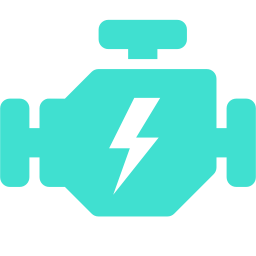

### Introdução ao IONIC

Autor: Andrew Ribeiro

---
### Plano de Aula
- O que é IONIC?
- História
- Arquitetura
- Como funciona
- Exemplos

---

### O que é IONIC?

----
<!-- .slide: data-background="iphone-smartphone.jpeg"-->
## Um framework de desenvolvimento mobile

----
<!-- .slide: data-background="iphone-smartphone.jpeg"-->

**De acordo com documentação oficial**
> _Ionic Framework é um kit de desenvolvimento open source para a criação de aplicações mobile e desktop performaticas e de alta-qualidade usando tecnologias web (HTML, CSS, and JavaScript)._

---

### História

----
<!-- .slide: data-background="drifty.jpg" -->
#### Criada em 2013 pela empresa ***Drifty***.

 &nbsp;Codiqa
 <!-- .element: class="fragment" -->

&nbsp;Jetstrap
 <!-- .element: class="fragment" -->

----

<!-- .slide: data-background-video="codiqa.webm" -->

## CODIQA

----

<!-- .slide: data-background-video="jetstrap.webm" -->

## JETSTRAP

----

<!-- .slide: data-background="customers.jpg" -->

### Feedback de clientes

----

<!-- .slide: data-background="ionic_2013.png" -->

Em Novembro de 2013 a versão Alpha foi lançada. <!-- .element: class="fragment" -->

Em Março de 2014, saiu a versão Beta 1.0. <!-- .element: class="fragment" -->

Em Maio de 2015, versão final 1.0. <!-- .element: class="fragment" -->

Em 2016, diversos lançamentos da versão 2.0. <!-- .element: class="fragment" -->

<h4>Em 2015, mais de 1.5M<!-- .element: class="fragment highlight-blue" --> de apps publicados com IONIC.</h4> <!-- .element: class="fragment" -->

----

<!-- .slide: data-background="ionic_2013.png" -->

Janeiro de 2019

## IONIC 4

---

### Arquitetura

----

----

---

### Como funciona?

